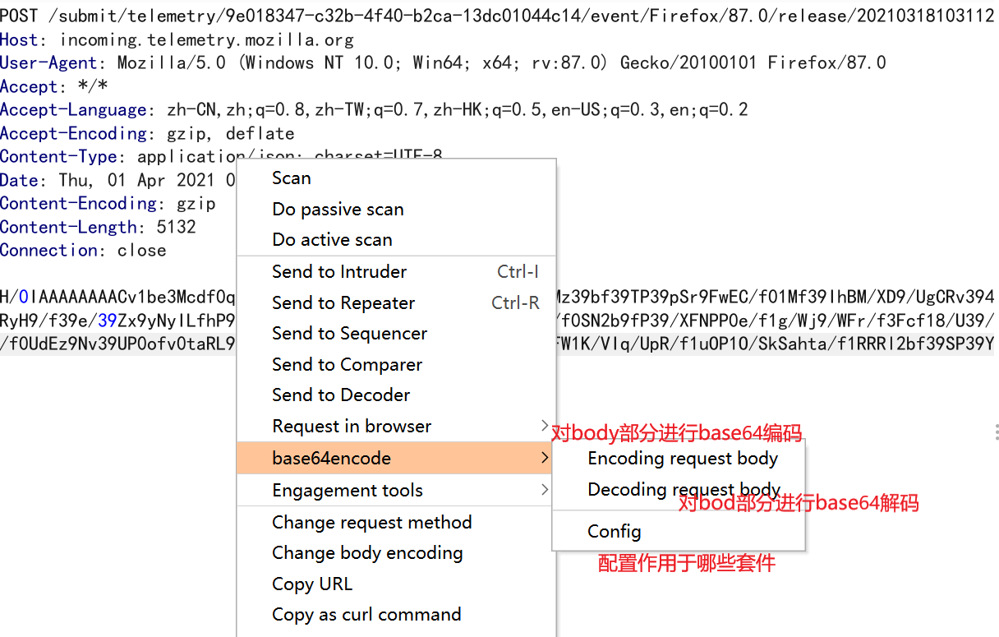
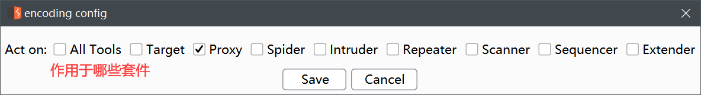

## burpsuite POST数据包base64编码插件

**适用场景：**

使用burp作为代理，经过burp的数据包会自动进行base64编码（仅限POST包）。

**使用方法：**

使用mavn进行编译后加载到burp的Extensions中使用，或者直接在右侧Release中下载编译好的jar包加载使用。

编译方法

```txt
mvn package
```

**插件截图**






**后期计划：**

- 增加更多编码功能，例如URL编码，unicode编码等。

- 增加加密功能：例如md5，AES等。

## 感谢

本插件的思路和外观借用了[chunked-coding-converter](https://github.com/c0ny1/chunked-coding-converter)插件，这是一款很优秀的插件，向它的作者c0ny1学习。
